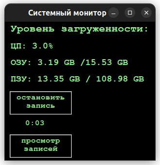
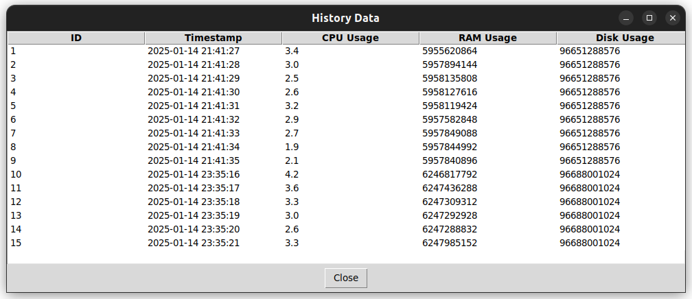

# sys-monitor-app
A simple system resource monitoring app with real-time CPU, RAM, and Disk usage tracking.

# Системный монитор

Это приложение для мониторинга загрузки процессора, оперативной памяти и дискового пространства в реальном времени. 

## Функциональность

- Отображение текущего уровня загрузки процессора, памяти и дисков.
- Запись данных мониторинга в базу данных.
- Просмотр истории данных мониторинга.

## Установка и запуск

1. Клонируйте репозиторий:
   ```bash
   git clone https://github.com/xam1816/sys-monitor-app.git

### Скриншот 1


### Скриншот 2
